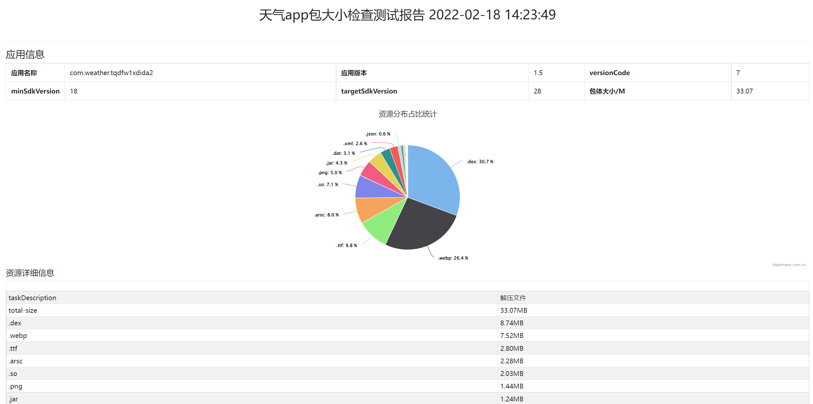

## 使用指南
 - 安装beautifulsoup (pip install beautifulsoup4 -i https://pypi.douban.com/simple) 或者项目目录下pip install -r requirements.txt
 - 修改项目目录下的check.json
    - --apk是apk存放的绝对路径,如果是windows系统的话复制文件夹的路径是反斜杠(\)，会报转义错误，改为正斜杠(/)
    - group下的第三个name需要改为apk的应用名称
 - 运行run.py文件,会在report文件夹下生成html文件,浏览器打开即可查看测试报告
 - 原理和参数解释参考[初探Matrix Android ApkChecker](https://www.cnblogs.com/lookingforfreedom/p/15897445.html)
 - 测试报告示例
    